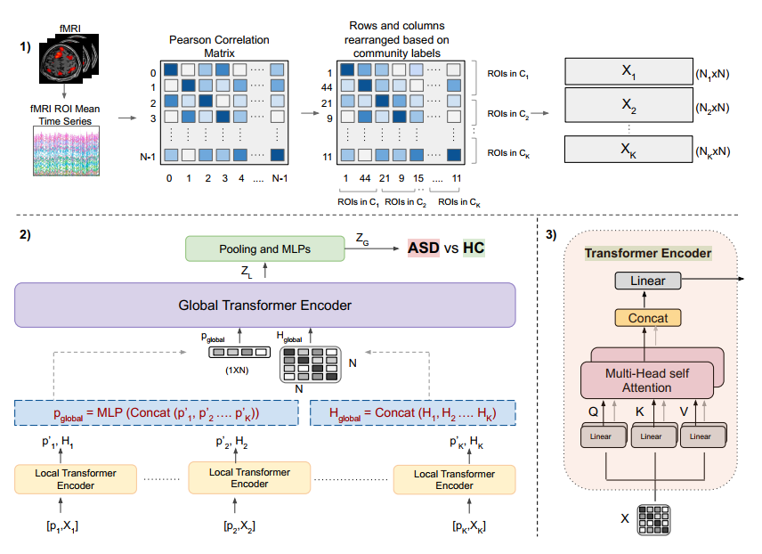

# Com-BrainTF
The official Pytorch implementation of [paper](https://arxiv.org/abs/2307.10181) "Community-Aware Transformer for Autism Prediction in fMRI Connectome" accepted by **MICCAI 2023**.

[Anushree Bannadabhavi](https://anushreebannadabhavi.github.io/), Soojin Lee, Wenlong Deng, [Xiaoxiao Li](https://xxlya.github.io/xiaoxiao/)

## Abstract

Autism spectrum disorder (ASD) is a lifelong neurodevelopmental condition that affects social communication and behavior. Investigating functional magnetic resonance imaging (fMRI)-based brain functional connectome can aid in the understanding and diagnosis of ASD, leading to more effective treatments. The brain is modeled as a network of brain Regions of Interest (ROIs), and ROIs form communities and knowledge of these communities is crucial for ASD diagnosis. On the one hand, Transformer based models have proven to be highly effective across several tasks, including fMRI connectome analysis to learn useful representations of ROIs. On the other hand, existing transformer-based models treat all ROIs equally and overlook the impact of community-specific associations when learning node embeddings. To fill this gap, we propose a novel method, **Com-BrainTF**, a hierarchical local-global transformer architecture that learns intra and inter-community aware node embeddings for ASD prediction task. Furthermore, we avoid over-parameterization by sharing the local transformer parameters for different communities but optimize unique learnable prompt tokens for each community. Our model outperforms state-of-the-art (SOTA) architecture on ABIDE dataset and has high interpretability, evident from the attention module.

## Overall Pipeline



1) fMRI images parcellated by an atlas to obtain the Functional connectivity matrix for ’N’ ROIs. Rows and columns are rearranged based on community labels of
each ROI to obtain input matrices to local transformer
2) Overview of our local-global transformer architecture: Human brain connectome is a hierarchical structure with ROIs in the same community having greater similarities compared to inter-community similarities. Therefore, we designed a local-global transformer architecture that mimics this hierarchy and efficiently leverages community labels to learn community-specific node embeddings. This approach allows the model to effectively capture both local and global information.
3) Transformer encoder module

## Usage

Abide dataset available [here](https://drive.google.com/file/d/1rTmBuLbMNu-vW7g43eSu21ur1Sc4oVHh/view?usp=sharing).

1. Update *path* in the file *source/conf/dataset/ABIDE.yaml* to the path of your dataset.

2. *node_clus_map.pickle* contains the ROI-Functional Network assignments (a dictionary of the form ROI:Community {0:1, 1:3, .... 199:7}). 
For ABIDE, ROI-Functional Network assignments follows the Yeo 7 network template (Yeo et al. J Neurophysiol. 2011). Replace this file if you use a different dataset.

3. Run the following command to train the model.

```bash
python -m source --multirun datasz=100p model=comtf dataset=ABIDE repeat_time=5 preprocess=non_mixup
```
- **datasz**, default=(10p, 20p, 30p, 40p, 50p, 60p, 70p, 80p, 90p, 100p). Percentage of the total number of samples in the dataset to use for training.

- **model**, default=(comtf,fbnetgen,brainnetcnn). Model to be used.

- **dataset**, default=(ABIDE). Dataset to be used.

- **repeat_time**, default=5. Number of times to repeat the experiment.

- **preprocess**, default=(mixup, non_mixup). Data pre-processing.

## Dependencies

  - python=3.9
  - cudatoolkit=11.3
  - torchvision=0.13.1
  - pytorch=1.12.1
  - torchaudio=0.12.1
  - wandb=0.13.1
  - scikit-learn=1.1.1
  - pandas=1.4.3
  - hydra-core=1.2.0

## Acknowledgement

We built Com-BrainTF on top of [BNT](https://github.com/Wayfear/BrainNetworkTransformer/tree/main)
